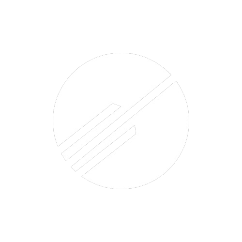
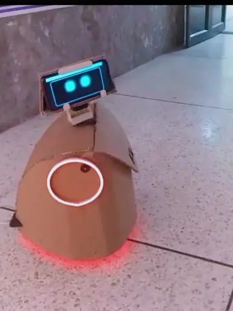
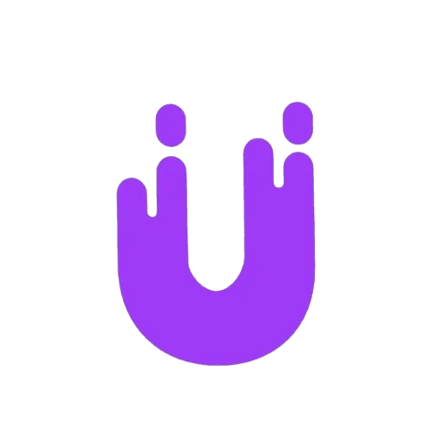

# Hamza Hafeez

### Software & AI Systems Engineer
**Founder · Multi-agent systems · Security · Backend**

I build production AI systems end-to-end; architecture, code, shipping, and the hard parts after launch.

---

## Currently shipping

<table>
  <tr>
    <td align="center" width="50%" valign="top">
       
      
      <h3><a href="https://www.histeeria.com">Histeeria</a></h3>
      
<b>Founder & Sole Engineer</b>

      

        Trust infrastructure for AI agents. 
        Judgment profiles across 8 dimensions. 
        SDKs → evaluation pipeline → dashboards → reports.
      

      

        <a href="https://www.histeeria.com">Website</a> ·
        <a href="https://github.com/histeeria">GitHub</a>
      

    </td>
    <td align="center" width="50%" valign="top">
       
      
      <h3><a href="https://www.cortex-edr.com">Cortex EDR</a></h3>
      
<b>Founder & Chief Engineer</b>

      

        Multi-agent application security platform. 
        7-agent scan pipeline · CWE/OWASP reports · AI chat advisor. 
        Production SaaS with auth, billing, and CI/CD.
      

      

        <a href="https://www.cortex-edr.com">Website</a> ·
        <a href="https://github.com/Cortex-EDR">GitHub</a> ·
        <a href="https://www.npmjs.com/package/@cortexedr/cli">npm</a>
      

    </td>
  </tr>
  <tr>
    <td align="center" width="50%" valign="top">
       
      
      <h3><a href="https://github.com/hmza-hb/Anya">Anya</a></h3>
      
<b>Architect & Creator</b>

      

        Emotionally aware companion-robot OS. 
        NATS event architecture · Raspberry Pi brain · phone as sensors.
      

      

        <a href="https://github.com/hmza-hb/Anya">GitHub</a>
      

    </td>
    <td align="center" width="50%" valign="top">
       
      
      <h3><a href="https://www.upvistadigital.com">Upvista Digital</a></h3>
      
<b>Founder / Engineer</b>

      

        Software & AI studio. 
        Clients across Japan, US, Germany, New Zealand, Singapore, Pakistan.
      

      

        <a href="https://www.upvistadigital.com">Website</a>
      

    </td>
  </tr>
  <tr>
    <td align="center" width="50%" valign="top">
       
      
      <h3>Vista AI</h3>
      
<b>Builder</b>

      

        Speech-first companion experiment. 
        Early product work before the current venture stack.
      

    </td>
    <td align="center" width="50%" valign="top">
       
      
      <h3><a href="https://github.com/hmza-hb/Project-Cortex">Project Cortex</a></h3>
      
<b>Research Author</b>

      

        Prefrontal-cortex-inspired AGI architecture. 
        36-page paper · reviewed by 57 researchers.
      

      

        <a href="https://github.com/hmza-hb/Project-Cortex">Paper / GitHub</a>
      

    </td>
  </tr>
</table>

---

## How I work

I own the full loop: research → architecture → implementation → production → iteration.

**AI systems** · multi-agent pipelines, LLM routing, evaluation / judgment loops, RAG  
**Backend** · Go, FastAPI, PostgreSQL, Redis, NATS, WebSockets, multi-tenant SaaS  
**Security** · OWASP / CWE analysis, SAST, local-first tooling, secure auth  
**Delivery** · SDKs, CLIs, billing, CI/CD, docs, client shipping

  
  
  
  
  
  
  
  
  

---

## Stats

| Metric | Value |
|:---|:---:|
| Production systems owned end-to-end | `22` |
| Multi-agent pipelines shipped | `4` |
| Countries served via Upvista | `6` |
| Research reviews (Project Cortex) | `57` |
| Hackathons won | `5` |
| Mode | **Solo founder-engineer** |

---

## Activity

 

---

### I take things apart. I understand them. I build the next version better.

**[hamza-hafeez.site](https://hamza-hafeez.site)** · Lahore, Pakistan · Remote-ready

